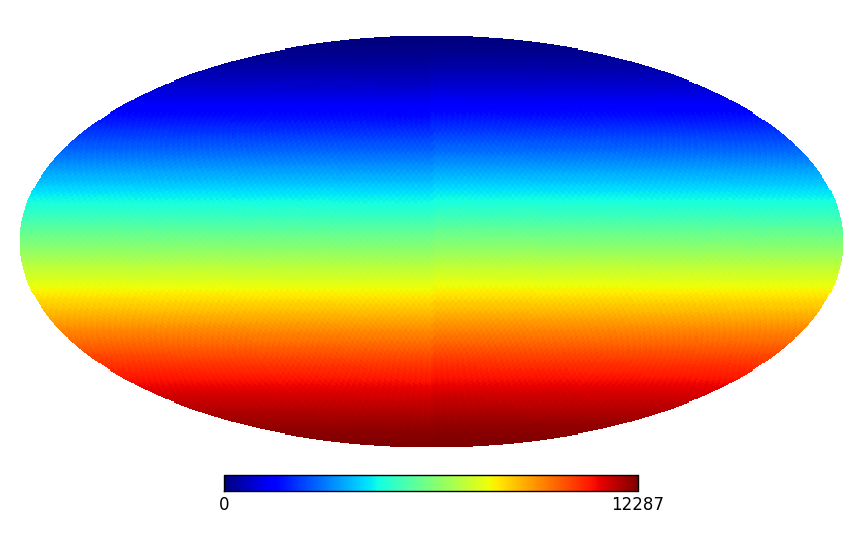
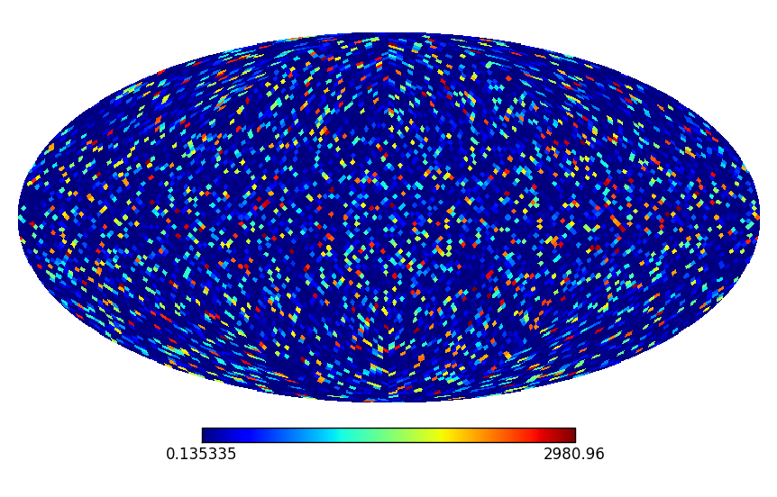
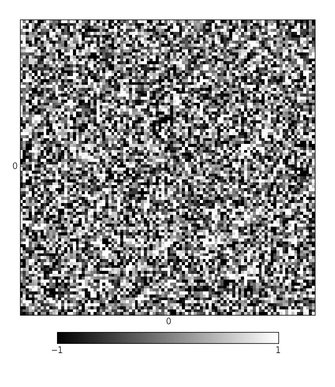

.. _informal_label:

First steps -- An informal introduction
=======================================

New to Python?
--------------

If you are new to Python, it is recommended that you familiarize yourself with Python before proceeding with the NIFTY tutorial. Start with `an informal introduction to Python <http://docs.python.org/2/tutorial/introduction.html>`_.

NIFTY Tutorial
--------------

.. currentmodule:: nifty

.. automodule:: nifty

NIFTY enables the programming of grid and resolution independent algorithms. In particular for signal inference algorithms, where a continuous signal field is to be recovered, this freedom is desirable. This is achieved with an object-oriented infrastructure that comprises, among others, abstract classes for :ref:`spaces <spaces>`, :ref:`fields <fields>`, and :ref:`operators <operators>`. All those are covered in this tutorial.

You should be able to import NIFTY like this after a successfull `installation <install.html>`_.

>>> from nifty import *

.. note:: During the import of NIFTY, other (common) modules get imported as well: ``import os``, ``import numpy as np``, and ``import pylab as pl``.

For a version statement and further settings you can access the global ``about`` variable.

>>> about
nifty version 0.4.0

.. _spaces:

Spaces
......

The very foundation of NIFTY's framework are the spaces, of which there are:

+--------------------------+-------------------------------------------------------------------+----------------------------------------------+
| Space subclass           | Corresponding grid                                                | Conjugate space class                        |
+==========================+===================================================================+==============================================+
| :py:class:`Space`        | the base space class                                              | (none)                                       |
+--------------------------+-------------------------------------------------------------------+----------------------------------------------+
| :py:class:`RGSpace`      | *n*-dimensional regular Euclidean grid over :math:`\mathcal{T}^n` | :py:class:`RGSpace`                          |
+--------------------------+-------------------------------------------------------------------+----------------------------------------------+
| :py:class:`LMSpace`      | spherical harmonics                                               | :py:class:`GLSpace` or :py:class:`HPSpace`   |
+--------------------------+-------------------------------------------------------------------+----------------------------------------------+
| :py:class:`GLSpace`      | Gauss-Legendre grid on the :math:`\mathcal{S}^2` sphere           | :py:class:`LMSpace`                          |
+--------------------------+-------------------------------------------------------------------+----------------------------------------------+
| :py:class:`HPSpace`      | HEALPix grid on the :math:`\mathcal{S}^2` sphere                  | :py:class:`LMSpace`                          |
+--------------------------+-------------------------------------------------------------------+----------------------------------------------+

A space instance can be created by providing all required parameters. The printout of a space informs you about all the parameters set.

>>> space = RGSpace(10, naxes=2) # two-dimensional regular 10 x 10 grid of physical size 1 in position space
>>> print(space)
nifty.RGSpace instance
- num        = [10, 10]
- naxes      = 2
- hermitian  = True
- purelyreal = True
- zerocenter = [True, True]
- dist       = [0.1, 0.1]
- fourier    = False

>>> space = HPSpace(32) # HEALPix grid with nside = 32
>>> print(space)
nifty.HPSpace instance
- nside = 32

.. note:: All instances of space classes can be compared by ``==`` or ``!=`` (or ``<>``); instances of the same class allow additionally for comparison by ``<``, ``<=``, ``>=``, or ``>``.

The dimensionality of a space and its number of degrees of freedom are fundamental characteristics of a space, and can be accessed by :py:meth:`space.dim` and :py:meth:`space.dof`. Fields, which are discussed later, are defined on spaces and the array in which the field values are stored will be of the "split" dimensionality of this space.

>>> space = RGSpace(10, naxes=2)
>>> space.dim(split=False) # 100 grid points
100
>>> space.dim(split=True) # structured 10 x 10
array([10, 10])

>>> space = HPSpace(32)
>>> space.dim() # == 12 * nside ** 2
12288

Nested spaces
,,,,,,,,,,,,,

The :py:class:`nested_space` class is designed to handle arbitrary product spaces. This is useful for outer products of fields and for grouping fields.

>>> space = nested_space([point_space(8), rg_space(10, naxes=2), hp_space(32)])
>>> print(space)
nifty.nested_space instance
- nest = [<nifty.point_space>, <nifty.rg_space>, <nifty.hp_space>]
>>> space.dim(split=True)
array([    8,    10,    10, 12288])

Conjugate spaces
,,,,,,,,,,,,,,,,

Spatial symmetries of a system can be exploited by corresponding coordinate transformations. Often, transformations from one basis to its harmonic counterpart can greatly reduce the computational complexity of an algorithm. The "harmonic" (or "conjugate") basis is defined by the eigenbasis of the Laplace operator. This conjugation of bases is implemented in NIFTY by distinguishing conjugate space classes.

Since the basis transformation from one basis to itself is trivial, the evaluation of :py:meth:`space.check_codomain` to itself always returns ``True``.

A valid conjugate space is obtained by :py:meth:`space.get_codomain`. For example, the conjugate basis of a flat position space is the Fourier basis.

>>> x_space = RGSpace(10, dist=0.2) # position space housing purely real field values
>>> print(x_space)
nifty.RGSpace instance
- num        = [10]
- naxes      = 1
- hermitian  = True
- purelyreal = True
- zerocenter = [True]
- dist       = [0.2]
- fourier    = False
>>> k_space = x_space.get_codomain() # Fourier space housing complex field values
>>> print(k_space)
nifty.rg_space instance
- num        = [10]
- naxes      = 1
- hermitian  = True
- purelyreal = False
- zerocenter = [True]
- dist       = [0.5]
- fourier    = True
>>> x_space.check_codomain(k_space)
True
>>> x_space == k_space.get_codomain()
True
>>> x_space.dof() == k_space.dof() == 10 # due to hermitian symmetry
True

For spherical position spaces a spherical harmonics transformation yields the conjugate basis.

>>> k_space = lm_space(95) # spherical harmonics with lmax = 95
>>> print(k_space)
nifty.lm_space instance
- lmax     = 95
- mmax     = 95
- datatype = numpy.complex128
>>> print(k_space.get_codomain(coname="gl")) # corresponding Gauss-Legendre grid
nifty.gl_space instance
- nlat     = 96
- nlon     = 191
- datatype = numpy.float64
>>> print(k_space.get_codomain(coname="hp")) # corresponding HEALPix grid
nifty.hp_space instance
- nside = 32

The physical volume of a conceptually continuous space is returned by :py:meth:`space.get_meta_volume` (per pixel or in total). This is not useful for discrete spaces, such as the :py:class:`point_space` or the :py:class:`lm_space`.

>>> space = point_space(8)
>>> space.discrete
True

>>> x_space = rg_space(10, dist=0.2)
>>> x_space.get_meta_volume(total=True) # == 10*0.2
2.0
>>> k_space = x_space.get_codomain()
>>> k_space.dist() # == 1/(10*0.2)
array([ 0.5])
>>> k_space.get_meta_volume(total=True) # == 10*0.5
5.0

>>> space = hp_space(32)
>>> space.get_meta_volume(total=True) # == 4*pi
12.566370614359172

.. _power_index:

`(Read more about spaces.) <space.html>`_

Power indexing **(advanced)**
,,,,,,,,,,,,,,,,,,,,,,,,,,,,,

The basis transformations mapping positions to wave vectors, :math:`\vec{x} = (x_1,x_2,\dots) \mapsto \vec{k} = (k_1,k_2,\dots)`, contain several computationally interesting quantities that are summarized in the following. Those quantities, called "power indices", can be accessed in different ways: (a) by the :py:attr:`space.power_indices` dictionary after the :py:meth:`space.set_power_indices` method has been evaluated once, (b) automatically by forwarding the respective space instance, or (c) by handling the output of the :py:meth:`space.get_power_indices` method; the latter is not recommended. (Only spaces representing the conjugate basis of a position space can evaluate those instance methods without raising an exception.)

For each grid point position :math:`\vec{k}` one can compute its abolute :math:`k = \big| \vec{k} \big|`. All the appearing absolute values (*irreducible spectral indices*) and their frequency of appearence (*number of degrees of freedom*) are represented as ``kindex`` and ``rho`` for each *irreducible spectral band*. In turn, one can assign each band an integer indicating the position in the ``kindex`` array and thus fill an array of the full size of the space that is denoted ``pindex``. (Indexing with the *unindexing* list ``pundex`` undoes the indexing with the *indexing* array ``pindex``.)

How does this look in practice? Below, a regular :math:`4 \times 4` grid is initialized with unit distance. The ``pindex`` shows :math:`4 \times 4` array with ``0`` at its "center" :math:`(k=0)`. The four nearest neighbors :math:`(k=1)` are right next to it and four second next neighbors :math:`(k=\sqrt{2})` touch the edges of the "center". Accordingly, the ``kindex`` reads :math:`(0,1,\sqrt{2},\dots)` and the ``rho`` :math:`(1,4,4,\dots)`.

>>> k_space = rg_space([4, 4], dist=1, fourier=True) # Fourier space
>>> k_space.set_power_indices() # power indices are computed
>>> k_space.power_indices["pindex"]
array([[5, 4, 3, 4],
       [4, 2, 1, 2],
       [3, 1, 0, 1],
       [4, 2, 1, 2]])
>>> k_space.power_indices["kindex"]
array([ 0.        ,  1.        ,  1.41421356,  2.        ,  2.23606798,  2.82842712])
>>> k_space.power_indices["rho"]
array([1, 4, 4, 2, 4, 1])

.. note:: The :py:meth:`rg_space.set_power_indices` method allows for a (re)binning of the spectral indices which is useful for high dimensional settings.

Since the :py:class:`lm_space` is discrete, the angular quantum number :math:`\ell` (instead of some :math:`\big| \vec{\ell} \big|`) labels the indices of which there are :math:`2\ell+1`.

>>> k_space = lm_space(3) # spherical harmonics with lmax = 3
>>> k_space.set_power_indices() # power indices are computed
>>> k_space.power_indices["pindex"]
array([0, 1, 2, 3, 1, 2, 3, 2, 3, 3])
>>> k_space.power_indices["kindex"]
array([0, 1, 2, 3])
>>> k_space.power_indices["rho"]
array([1, 3, 5, 7])

One advantage of basis conjugation is that the covariance of a :ref:`Gaussian random field <Garfields>` that is statistically homogeneous in position space becomes diagonal in the harmonic basis. This diagonal is then called power spectrum. Therefore, operations that involve power spectra or spectral bands in general require "power indexing".

.. _fields:

Fields
......

The actual algorithmic work is done on the level of fields. In order to initialize a field instance, a ``domain``, the space in which the field is defined, needs to be stated. The field values ``val`` are all set to zero, if not given, and the ``target``, the default conjugate space, is obtained by default using ``domain.get_codomain()``. The printout of a field informs you about all those three properties of a field.

>>> f = field(point_space(8)) # field of 8 points all carrying 0.0
>>> print(f)
nifty.field instance
- domain      = <nifty.point_space>
- val         = [...]
  - min.,max. = [0.0, 0.0]
  - med.,mean = [0.0, 0.0]
- target      = <nifty.point_space>

Any field can be initialized with random numbers by specifying the `random` keyword and further constraints.

>>> f = field(rg_space([4, 4]), random="gau") # field of 4 x 4 grid points filled with Gaussian random numbers
>>> f.val
array([[-0.48543864, -1.56595855,  0.38683479,  1.08021123],
       [ 0.26197572, -0.2245229 ,  1.61690895, -1.28385473],
       [ 3.04056877, -0.48699409,  0.44017361,  0.03244873],
       [-0.88216182, -0.11849966,  0.51377166, -0.37855755]])
>>> f.domain.fourier
False
>>> f.target.fourier
True

More informative than the printout of a field is of course a plot obtained by :py:meth:`field.plot`.

>>> space = hp_space(32)
>>> f = field(space, val=np.arange(space.dim()))
>>> f.plot() # a pylab figure will open.

Basic operations
,,,,,,,,,,,,,,,,

The field values are stored as a `numpy.ndarray <http://docs.scipy.org/doc/numpy/reference/generated/numpy.ndarray.html>`_ and can be accessed by the ``val`` property or by indexing the field with ``[:]``.

>>> f = field(point_space(8), val=3) # field of 8 points all carrying 3.0
>>> f.val
array([ 3.,  3.,  3.,  3.,  3.,  3.,  3.,  3.])
>>> f[:] # standard numpy indexing
array([ 3.,  3.,  3.,  3.,  3.,  3.,  3.,  3.])

Standard operations (``+``, ``-``, ``*``, ``/``, ...) are available for fields of the same domain.

>>> f = field(rg_space(4), val=3)
>>> u = field(rg_space(4), val=[0, 1, 2, 3])
>>> f + u
<nifty.field>
>>> (f ** u)[2] # == 3.0 ** 2.0
9.0

.. warning:: The Python interpreter reads from left to right. As a consequence, the compatibility to NumPy arrays introduces the following ambiguity, ``field + array == field`` but ``array + field == array``.

Trigonometric, exponential, and logarithmic functions are also valid
`field operations <field_operations.html>`_. They are applied for each
field value individually.

>>> f = field(hp_space(32), random="uni", vmin=-2, vmax=8)
>>> exp(f).plot(vmin=exp(-2), vmax=exp(8)) # a pylab figure will open.

Inner & outer products
,,,,,,,,,,,,,,,,,,,,,,

This section deals with the inner and outer products provided by :py:meth:`field.dot`, :py:meth:`field.pseudo_dot`, and :py:meth:`field.tensor_dot`. The crucial point is that those products involove position integrals over continuous position spaces that are approximated by weighted sums.

The scalar product implemented in :py:meth:`field.dot` of two fields :math:`a` and :math:`b` describes the following approximation, where :math:`V_q` is the volume of the :math:`q`\th pixel (:math:`\Omega` some position space, :math:`x \in \Omega` a position, :math:`q \in \{1,\dots,Q\}` a discrete index; :math:`^\dagger` denotes transposition and complex conjugation, and :math:`^*` only the latter).

.. math::

    a^\dagger b \quad\equiv\quad \int_{\Omega} \mathrm{d}x \; a^*(x) \; b(x) \quad\approx\quad \sum_{q=1}^Q V_q \; a^*_q \; b_q

In discrete spaces the scalar product is the common inner Euclidean product.

>>> f = field(point_space(8), val=3) # here Vpix = 1
>>> f.domain.discrete
True
>>> f.dot(f) # == 8 * (3.0 * 3.0)
72.0

In conceptually continuous spaces the scalar product respects the physical size of the space.

>>> f = field(rg_space(4, dist=0.5), val=3) # here Vpix = 0.5
>>> f.dot(f) # == 4 * 0.5 * (3.0 * 3.0)
18.0

>>> f = field(hp_space(32), val=0.25) # here Vpix = (4 * pi / Npix) and Npix = 12 * nside ** 2
>>> f.dot(1) # == Npix * Vpix * (0.25 * 1) == pi
3.1415926535896275
>>> f.dot(1/f) # == Npix * Vpix * (0.25 * 1 / 0.25) == 4 * pi
12.56637061435851

.. note:: The relation :math:`V_\mathrm{pix} = V_\mathrm{total} / N_\mathrm{pix}` is not true for all spaces.

The tensor product implemented in :py:meth:`field.tensor_dot` of two fields :math:`a` and :math:`b` yields a field :math:`c` that is defined on the product space of the domains of :math:`a` and :math:`b`. The tensor product is not symmetric.

.. math::

    a \otimes b = c \quad\equiv\quad c(x,y) = a(x) \cdot b(y)

>>> a = field(point_space(8), val=np.arange(1, 9))
>>> b = field(rg_space(4), val=[0, 2, 4, 8])
>>> c = a.tensor_dot(b)
>>> print(c)
nifty.field instance
- domain      = <nifty.nested_space>
- val         = [...]
  - min.,max. = [0.0, 64.0]
  - med.,mean = [11.0, 15.75]
- target      = <nifty.nested_space>
>>> print(c.domain)
nifty.nested_space instance
- nest = [<nifty.point_space>, <nifty.rg_space>]
>>> c.val # shape (8, 4)
array([[  0.,   2.,   4.,   8.],
       [  0.,   4.,   8.,  16.],
       [  0.,   6.,  12.,  24.],
       [  0.,   8.,  16.,  32.],
       [  0.,  10.,  20.,  40.],
       [  0.,  12.,  24.,  48.],
       [  0.,  14.,  28.,  56.],
       [  0.,  16.,  32.,  64.]])
>>> b.tensor_dot(a)[:] # shape (4, 8)
array([[  0.,   0.,   0.,   0.,   0.,   0.,   0.,   0.],
       [  2.,   4.,   6.,   8.,  10.,  12.,  14.,  16.],
       [  4.,   8.,  12.,  16.,  20.,  24.,  28.,  32.],
       [  8.,  16.,  24.,  32.,  40.,  48.,  56.,  64.]])

The pseudo scalar product implemented in :py:meth:`field.pseudo_dot` performs a scalar product in some dimensions and returns a scalar or a field, which might be explained best with an example following the last one.

>>> a = field(point_space(8), val=np.arange(1, 9))
>>> b = field(rg_space(4), val=[0, 2, 4, 8]) # Vpix = 0.25
>>> c = a.tensor_dot(b)
>>> b.dot(b) # == 0.25 * (0.0 ** 2 + 2.0 ** 2 + 4.0 ** 2 + 8.0 ** 2)
21.0
>>> c.pseudo_dot(b)
<nifty.field>
>>> c.pseudo_dot(b).val # == a * (b.dot(b))
array([  21.,   42.,   63.,   84.,  105.,  126.,  147.,  168.])
>>> b.dot(1) # == 0.25 * (0.0 * 1 + 2.0 * 1 + 4.0 * 1 + 8.0 * 1)
3.5
>>> c.pseudo_dot(1).val # == a * (b.dot(1))
array([  3.5,   7. ,  10.5,  14. ,  17.5,  21. ,  24.5,  28. ])
>>> c.dot(c) # == (a.dot(a)) * (b.dot(b))
4284.0
>>> c.dot(1) # == (a.dot(1)) * (b.dot(1))
126.0

Transformations
,,,,,,,,,,,,,,,

In order to take the full advantage of basis transformations, each field instance can evaluate its :py:meth:`field.transform` method that applies a transformation from the field's domain to its target. The field's transform is again a field and therefore a valid input for field methods. In favor of user-friendliness, transformations between harmonic bases may be applied automatically if required.

>>> x_space = hp_space(32)
>>> k_space = x_space.get_codomain()
>>> f = field(x_space, val=1)
>>> f.transform()
<nifty.field>
>>> f.domain == x_space
True
>>> f.target == k_space
True
>>> f.transform().domain == k_space
True
>>> f.transform().target == x_space
True
>>> f.dot(f)
12.56637061435851
>>> f.dot(f.transform())
12.56637061435851
>>> f.transform().dot(f)
12.56637061435917
>>> f.transform().dot(f.transform())
12.56637061435917

.. note:: Transformations between conjugate spaces are performed automatically if required.

A non-standard transformation can be applied by explicitly stating a target that is a valid codomain (valid by means of `check_codomain` returns ``True``).

>>> k_space = lm_space(383)
>>> x1_space = k_space.get_codomain(coname="hp") # corresponding HEALPix grid
>>> x2_space = k_space.get_codomain(coname="gl") # corresponding Gauss-Legendre grid
>>> f = field(x1_space, val=np.load("/SOMEWHERE/nifty/demos/demo_faraday_map.npy")) # field values with some easily visible features
>>> from nifty.nifty_cmaps import *
>>> f.plot(vmin=-4, vmax=4, cmap=ncmap.fm()) # a pylab figure will open.
>>> f.transform(target=k_space).transform(target=x2_space).plot(vmin=-4, vmax=4, cmap=ncmap.fm()) # another pylab figure will open.

+----------------------------+----------------------------+
| .. image:: images/f_00.png | .. image:: images/f_01.png |
|     :width:  66 %          |     :width:  66 %          |
+----------------------------+----------------------------+

More methods
,,,,,,,,,,,,

The :py:class:`field` class offers further methods, which are listed in the following table, at your disposal. Some of those have been discussed already.

+------------------------------+-----------------------------------------------------------------------------------------------+
| Method name                  | Description                                                                                   |
+==============================+===============================================================================================+
| :py:meth:`Field.cast_domain` | Alters the field's domain without altering the field values or the codomain.                  |
+------------------------------+-----------------------------------------------------------------------------------------------+
| :py:meth:`Field.conjugate`   | Complex conjugates the field values.                                                          |
+------------------------------+-----------------------------------------------------------------------------------------------+
| :py:meth:`Field.dim`         | Returns the dimensionality of the field.                                                      |
+------------------------------+-----------------------------------------------------------------------------------------------+
| :py:meth:`Field.dot`         | Applies the scalar product between two fields, returns a scalar.                              |
+------------------------------+-----------------------------------------------------------------------------------------------+
| :py:meth:`Field.hat`         | Translates the field into a diagonal operator.                                                |
+------------------------------+-----------------------------------------------------------------------------------------------+
| :py:meth:`Field.inverse_hat` | Translates the inverted field into a diagonal operator.                                       |
+------------------------------+-----------------------------------------------------------------------------------------------+
| :py:meth:`Field.norm`        | Returns the :math:`L^2`-norm of the field.                                                    |
+------------------------------+-----------------------------------------------------------------------------------------------+
| :py:meth:`Field.plot`        | Draws a figure illustrating the field.                                                        |
+------------------------------+-----------------------------------------------------------------------------------------------+
| :py:meth:`Field.power`       | Computes the power spectrum of the field values.                                              |
+------------------------------+-----------------------------------------------------------------------------------------------+
| :py:meth:`Field.pseudo_dot`  | Applies a scalar product between two fields on a certain subspace of a product space, returns |
|                              | a scalar or a field, depending on the subspace.                                               |
+------------------------------+-----------------------------------------------------------------------------------------------+
| :py:meth:`Field.set_target`  | Alters the field's codomain without altering the domain or the field values.                  |
+------------------------------+-----------------------------------------------------------------------------------------------+
| :py:meth:`Field.set_val`     | Alters the field values without altering the domain or codomain.                              |
+------------------------------+-----------------------------------------------------------------------------------------------+
| :py:meth:`Field.smooth`      | Smoothes the field values in position space by convolution with a Gaussian kernel.            |
+------------------------------+-----------------------------------------------------------------------------------------------+
| :py:meth:`Field.tensor_dot`  | Applies a tensor product between two fields, returns a field defined in the product space.    |
+------------------------------+-----------------------------------------------------------------------------------------------+
| :py:meth:`Field.transform`   | Applies a transformation from the field's domain to some codomain.                            |
+------------------------------+-----------------------------------------------------------------------------------------------+
| :py:meth:`Field.weight`      | Multiplies the field with the grid's volume factors (to a given power).                       |
+------------------------------+-----------------------------------------------------------------------------------------------+

`(Read more about fields) <field.html>`_

.. _Garfields:

Gaussian random fields **(advanced)**
,,,,,,,,,,,,,,,,,,,,,,,,,,,,,,,,,,,,,

Since NIFTY shall assist in the development of inference, Gaussian random fields are discussed in this section. Gaussian random fields are fields drawn from a `multivariate normal distribution <http://en.wikipedia.org/wiki/Multivariate_normal_distribution>`_ that is characterized by its mean and covariance. (Here, only zero-mean Gaussians are discussed.)

The covariance is a symmetric and positive-definite operator of the squared dimension of the field. It describes the correlation between the field values: In its matrix representation, the covariance element :math:`(ij)` would describe the correlation between the field values :math:`i` and :math:`j`. The simplest covariance would be :math:`\delta_{ij}` producing field values that are uncorrelated, so called "white noise".

>>> x_space = rg_space(100, naxes=2)
>>> f = field(x_space, random="gau")
>>> f.plot(vmin=-1, vmax=1, cmap=pl.cm.gray) # a pylab figure will open.

If the covariance is only determined by a diagonal, this diagonal is referred to as *power spectrum*. The covariance, :math:`\delta_{ij}`, of the above field is denoted flat or "white" power spectrum. One way to introduce a correlation between the field values is to draw a field from a power spectrum that (a) bundles harmonic modes that have the same ``kindex``, :math:`k = \big| \vec{k} \big|`, and (b) has some non-flat structure. (Confer :ref:`power indexing <power_index>`.)

The obtained field is statistically homogeneous and isotropic, that means the correlation between two field values at positions :math:`\vec{x}` and :math:`\vec{y}` depends only on their physical distance :math:`\big| \vec{x} - \vec{y} \big| \propto 1/k`. The power spectrum is returned by :py:meth:`field.power`, and can also be plotted by :py:meth:`field.plot`.

>>> x_space = rg_space(100, naxes=2)
>>> k_space = x_space.get_codomain()
>>> spectrum_a = (lambda k: (1 / (k + 1)) ** 5)  # falling spectrum
>>> spectrum_b = (lambda k: (3 / (k + 10)) ** 5) # peaking spectrum
>>> a = field(x_space, target=k_space, random="syn", spec=spectrum_a)
>>> b = field(x_space, target=k_space, random="syn", spec=spectrum_b)
>>> a.plot()
>>> a.plot(power=True, other=(spectrum_a,spectrum_b), mono=False, vmin=1E-5, vmax=1E-1)
>>> b.plot()
>>> b.plot(power=True, other=(spectrum_a,spectrum_b), mono=False, vmin=1E-5, vmax=1E-1)

+----------------------------+----------------------------+
| .. image:: images/t_03.png | .. image:: images/t_04.png |
|     :width:  50 %          |     :width:  70 %          |
+----------------------------+----------------------------+
| .. image:: images/t_05.png | .. image:: images/t_06.png |
|     :width:  50 %          |     :width:  70 %          |
+----------------------------+----------------------------+

Note the difference between the given "theoretical" power spectrum (orange, blue) and the power spectrum from the field realization (green). A good way to get a feeling for Gaussian random fields is by playing around. Experiment with the spectra! (Adapt or omit the parameters ``vmin`` and ``vmax``!)

.. note:: At this point you can grasp the idea of grid and resolution independent code. Try to change the position space; for example, set ``x_space = hp_space(32)``!

.. _operators:

Operators
.........

The missing ingredient for manufacturing algorithms is the :py:class:`operator` class. All operators are initialized with a ``domain`` (optionally also with a ``target``) and various flags. The ``domain`` specifies the space in which input fields are defined (and the ``target`` specifies the space for output fields). According to the requirements of the operators, other parameters, like the general ``para`` property, need to be stated.

The most basic operator is returned by :py:func:`identity` and represents an identity in the specified domain. This (rather useless) operator shall serve as an educational example for getting to know the :py:class:`operator` class, or more precisely the :py:class:`diagonal_operator` class.

>>> space = point_space(8)
>>> f = field(space, val=3)
>>> I = identity(space) # == identity operator
>>> print(I)
<nifty.diagonal_operator>
>>> I.domain == I.target
True
>>> I(f) # == I.times(f) due to operator.__call__
<nifty.field>
>>> I.adjoint_inverse_times(f) # there are more operator.*times methods
<nifty.field>
>>> I(f).val
array([ 3.,  3.,  3.,  3.,  3.,  3.,  3.,  3.])
>>> I(5) # input may be raised to be a field
<nifty.field>
>>> I(5).val
array([ 5.,  5.,  5.,  5.,  5.,  5.,  5.,  5.])

If the domain is a continuous space, the appropriate weighting is done automatically in order to correctly approximate position integrals. However, this trivial task implies several discretization subtleties. (It matters if one absorbs the weights into the "bare" matrix entries.)

.. math::

    \mathrm{id}[a(x)] \quad\equiv\quad \int_{\Omega} \mathrm{d}y \; \underbrace{\delta(x-y)}_\mathrm{continuous} \; a(y)
    \quad\approx\quad \sum_{q=1}^Q V_q \; \underbrace{\phantom{P} \frac{\delta_{pq}}{V_q} \phantom{P}}_\mathrm{"bare"} \; a_q
    \quad=\quad \sum_{q=1}^Q \; \underbrace{\phantom{P} \delta_{pq} \phantom{P}}_\mathrm{"non-bare"} \; a_q

>>> space = rg_space(10, dist=0.2) # Vpix = 0.2
>>> I = identity(space) # == identity operator
>>> I.diag()
array([ 1.,  1.,  1.,  1.,  1.,  1.,  1.,  1.,  1.,  1.])
>>> I.diag(bare=True)
array([ 5.,  5.,  5.,  5.,  5.,  5.,  5.,  5.,  5.,  5.])
>>> I.inverse_diag(bare=True)
array([ 5.,  5.,  5.,  5.,  5.,  5.,  5.,  5.,  5.,  5.])
>>> I.hat() # diagonal to field
<nifty.field>
>>> I.hat().val
array([ 1.,  1.,  1.,  1.,  1.,  1.,  1.,  1.,  1.,  1.])

The involvement of volume weights can cause some confusion concerning the interpretation of the corresponding matrix elements. As shown above, the discretization of the continuous identity operator, which equals a :math:`\delta`-distribution, yields a weighted Kronecker-Delta. Nevertheless, the "bare" entries are the ones to be consulted for interpretation. -- Say a field is drawn from a zero-mean Gaussian with a covariance that equals the identity. The intuitive assumption that the field values have a variance of :math:`1` is not true; the variance is given by :math:`1/V_\mathrm{pix}`. Convince yourself by drawing a field with ``I.get_random_field()``!

The application of any operator is done by one of the :py:meth:`*times` methods that each invoke :py:meth:`_briefing`, :py:meth:`_*multiply` and :py:meth:`_debriefing` consecutively. The briefing and debriefing are generic methods in which in- and output are checked. This check includes a check of the field's properties, weighting of the field values and may include a basis transformation if required. The :py:meth:`_multiply` method, being the concrete part, then carries out the actual computation.

An operator thus interpretes a given input gently, and accepts scalars, lists, arrays (all raised to fields), and fields in the correct conjugate basis (due to the briefing). In turn, the operator tries to restore the input basis in the output field (in the debriefing).

>>> x_space = hp_space(32)
>>> k_space = x_space.get_codomain()
>>> f = field(x_space, random="uni", target=k_space)
>>> I = identity(x_space) # I.domain == x_space
>>> I(f).domain == x_space
True
>>> I(f).target == k_space
True
>>> I(f.transform()) # == I.times(f.transform().transform()).transform()
<nifty.field>
>>> I(f.transform()).domain == k_space
True
>>> I(f.transform()).target == x_space
True
>>> I.domain == x_space
True

.. note:: Transformations between conjugate spaces are performed automatically if required.

Moreover, every operator instance carries three flags, ``uni`` specifying whethter it is unitary, ``sym`` specifying whether it is symmetric, and ``imp`` specifying whethter the correct weighting is already applied internally, otherwise this is done in the (de)briefing.

Diagonal operators
,,,,,,,,,,,,,,,,,,

Instances of the :py:class:`diagonal_operator` class are initialized
by providing a domain and a diagonal.

>>> D = diagonal_operator(point_space(8), diag=[2,2,2,2,4,4,4,8])
>>> print(D)
<nifty.diagonal_operator>
>>> D.diag()
array([ 2.,  2.,  2.,  2.,  4.,  4.,  4.,  8.])
>>> D.dim()
array([8, 8])

However, it sometimes comes in handy to promote fields to diagonal operators, vice versa, or to project out the diagonal. Those casts are implemented by :py:meth:`hat` and :py:meth:`hathat`.

>>> D = diagonal_operator(rg_space(10), diag=2)
>>> D
<nifty.diagonal_operator>
>>> D.hat() # (only) diagonal to field
<nifty.field>
>>> D.hat().hat() # (only) diagonal to field to diagonal
<nifty.diagonal_operator>
>>> D.hathat() # (only) diagonal to diagonal
<nifty.diagonal_operator>
>>> D.inverse_hat().val # (only) inverse diagonal to field
array([ 0.5,  0.5,  0.5,  0.5,  0.5,  0.5,  0.5,  0.5,  0.5,  0.5])

The instance method :py:meth:`diag` returns the diagonal at any cost. For non-diagonal operators and operators that are diagonal in another basis this is done by :py:class:`diagonal_probing`, which is not always exact.

.. warning:: The default ``nrun`` for :py:class:`probing` is meant for test runs, but is in most cases insufficient for getting accurate results.

>>> x_space = hp_space(32)
>>> k_space = x_space.get_codomain()
>>> D = diagonal_operator(x_space, diag=2) # D.domain == x_space
>>> D.diag(domain=k_space, nrun=100) # probing in k_space
array([ 1.99890666 +0.00000000e+00j,  2.00066400 +0.00000000e+00j,
        1.99810763 +0.00000000e+00j, ...,  2.00000000 -1.87579648e-11j,
        2.00000000 -1.24384300e-10j,  2.00000000 -2.84119735e-11j])

Assuming that :py:class:`diagonal_operator` is a covariance a zero-mean Gaussian random field can be drawn by :py:meth:`diagonal_operator.get_random_field`. (Confer :ref:`Gaussian random fields <Garfields>`.)

Linear operators
,,,,,,,,,,,,,,,,

.. currentmodule:: nifty.nifty_explicit

Most of the operator classes in NIFTY describe linear operators that could be represented by an explicit matrix. In practice, an  implicit description is often more efficient, though.

An implicit operator can be cast into an explicit one using the :py:func:`explicify` function that returns an instance of the :py:class:`explicit_operator` class.

>>> space = point_space(3)
>>> D = diagonal_operator(space, diag=[1, 2, 3])
>>> E = explicify(D)
>>> E.get_matrix()
array([[ 1.,  0.,  0.],
       [ 0.,  2.,  0.],
       [ 0.,  0.,  3.]])

The ("bare") matrix is stored as a two-dimensional `numpy.ndarray <http://docs.scipy.org/doc/numpy/reference/generated/numpy.ndarray.html>`_ and can be accessed by the ``val`` property, by indexing the field with ``[:,:]``, or  -- as recommended -- by calling :py:meth:`explicit_operator.get_matrix`.

.. note:: The :py:meth:`get_matrix` method takes the keyword argument ``bare``. Compare the "bare" and "non-bare" matrices in case of a continuos space!

.. currentmodule:: nifty

Building your own operator
,,,,,,,,,,,,,,,,,,,,,,,,,,

Any self-built operator class should be inherited from the :py:class:`operator`. So it inherits the correct substructure and auxiliary methods. Then (almost) all it needs is the development of the :py:meth:`_multiply` method and a proper initialization.

Here, a *non-linear* operator that returns the componentwise squared field is constructed.

>>> class my_operator(operator):
...
...     def _multiply(self, x):
...         return x[:] ** 2
...

When an instance of ``my_operator`` is created, all relevant properties need to be set. Here, the domain and the ``imp`` flag suffice, and this keeps the operator useable in any space. (Since this is a componentwise operation and does not involve position integrals, the ``imp`` flag is set to ``True``.)

.. warning:: Setting the ``imp`` flag inaccurate can cause faulty algorithmic results that are hard to debug.

>>> space = point_space(8)
>>> M = my_operator(space, imp=True)
>>> M(3)
<nifty.field>
>>> M(3).val
array([ 9.,  9.,  9.,  9.,  9.,  9.,  9.,  9.])

>>> space = rg_space(10)
>>> M = my_operator(space, imp=True)
>>> M(3).val
array([ 9.,  9.,  9.,  9.,  9.,  9.,  9.,  9.,  9.,  9.])

In order to extend the ``my_operator`` class to be of more general use, the ``para`` property can by used.

>>> class my_operator(operator):
...
...     def _multiply(self, x):
...         return x[:] ** self.para
...

Since there are no constraints on ``para``, it can be of any desired type. (This is especially useful, if several instanced operators need to be combined. List them as one parameter and apply them insinde :py:meth:`_multiply` as required!)

>>> space = rg_space(10)
>>> M = my_operator(space, imp=True, para=2)
>>> M(3).val
array([ 9.,  9.,  9.,  9.,  9.,  9.,  9.,  9.,  9.,  9.])
>>> M = my_operator(space, imp=True, para=np.arange(space.dim()))
>>> M(2).val
array([   1.,    2.,    4.,    8.,   16.,   32.,   64.,  128.,  256.,  512.])

`(Read more about operators.) <operator.html>`_

Power & projection operators **(advanced)**
,,,,,,,,,,,,,,,,,,,,,,,,,,,,,,,,,,,,,,,,,,,

Although this section is restricted to statistically homogeneous and isotropic Gaussian random fields and power spectra thereof, everything discussed here is generalizable. (Confer :ref:`power indexing <power_index>` and :ref:`Gaussian random fields <Garfields>`.)

The :py:class:`power_operator` is a special :py:class:`diagonal_operator` that handles power spectra properly. A :py:class:`power_operator` performs applications invoked by :py:meth:`*times` analogous to a :py:class:`diagonal_operator`. The difference lies in its initialization, which requires a power spectrum instead of a diagonal, and in the :py:meth:`power_operator.get_random_field` and :py:meth:`power_operator.get_projection_operator` method.

>>> x_space = hp_space(32)
>>> k_space = x_space.get_codomain()
>>> spectrum = (lambda k: (1 / (k + 1)) ** 3)
>>> S = power_operator(k_space, spec=spectrum)
>>> f = S.get_random_field(domain=x_space) # == field(x_space, target=k_space, random="syn", spec=spectrum)
>>> f.plot() # a pylab figure will open.
>>> f.plot(power=True, other=spectrum, mono=False) # another pylab figure will open.

The advantages of a :py:class:`power_operator` are the automated indexing, the methods mentioned above, and the inherited ability to perform basis transformation on fields it is applied to. These concepts become more evident when considering an explicit example.

.. math::

    S\:\big( \phantom{\big|} \vec{k} \:,\: \vec{l} \phantom{\big|} \big) \quad=\quad P\big( \big| \vec{k} \big| \big) \; \delta\big( \vec{k} - \vec{l} \big)
    \qquad\qquad\qquad
    S\:\big( \phantom{\big|} \vec{x} \:,\: \vec{y} \phantom{\big|} \big) \quad=\quad S\:\big( \big| \vec{x} - \vec{y} \big| \big)

>>> x_space = rg_space(10, zerocenter=False)
>>> k_space = x_space.get_codomain()
>>> S = power_operator(k_space, spec=(lambda k: (1 / (k + 1) ** 2))) # implicit operator
>>> Skl = explicify(S) # matrix in k_space
>>> Skl.plot(cmap=pl.cm.gray_r) # a pylab figure will open.
>>> Sxy = explicify(S, newdomain=x_space) # matrix in x_space
>>> Sxy.plot(vmin=0, vmax=2, cmap=pl.cm.gray_r) # another pylab figure will open.

+---------------------------+---------------------------+
| .. image:: images/Skl.png | .. image:: images/Sxy.png |
|     :width:  50 %         |     :width:  50 %         |
+---------------------------+---------------------------+

The :py:class:`projection_operator` class was designed to create
arbitrary projections. Projections are performed onto a basis subset
-- the basis is defined by the space specified as domain, and the
subsets are constructed according to the ``assign`` keyword. (Using
:py:meth:`power_operator.get_projection_operator` those specifications
are superfluous, and projections will reproduce the harmonic modes.)
The initialized :py:meth:`projection_operator` by default projects to
all specified bands at once (resulting in a nested field), but
individual projections are possible by giving the keyword argument ``band``.

>>> x_space = hp_space(32)
>>> k_space = x_space.get_codomain()
>>> spectrum = (lambda k: (1 / (k + 1)) ** 3)
>>> S = power_operator(k_space, spec=spectrum)
>>> f = S.get_random_field(domain=x_space) # == field(x_space, target=k_space, random="syn", spec=spectrum)
>>> Sk = S.get_projection_operator() # == projection_operator(k_space, assign=k_space.power_indices["pindex"])
>>> len(k_space.power_indices["kindex"])
96
>>> Sk.bands()
96
>>> Sk(f)
<nifty.field>
>>> print(Sk(f).domain)
nifty.nested_space instance
- nest = [<nifty.point_space>, <nifty.hp_space>]
>>> print(Sk(f).domain.nest[0])
nifty.point_space instance
- num      = 96
- datatype = numpy.float64
>>> print(Sk(f).domain.nest[1])
nifty.hp_space instance
- nside = 32
>>> Sk(f,band=1)
<nifty.field>
>>> print(Sk(f,band=1).domain)
nifty.hp_space instance
- nside = 32

How does this look in practice? Below, the quadrupole of the "Faraday Map" is projected out.

>>> x_space = hp_space(128)
>>> k_space = x_space.get_codomain()
>>> f = field(x_space, val=np.load("/SOMEWHERE/nifty/demos/demo_faraday_map.npy")) # field values with some easily visible features
>>> Sk = projection_operator(k_space)
>>> from nifty.nifty_cmaps import *
>>> f.plot(vmin=-4, vmax=4, cmap=ncmap.fm()) # a pylab figure will open.
>>> Sk(f,band=2).plot(vmin=-4, vmax=4, cmap=ncmap.fm()) # another pylab figure will open.

+----------------------------+----------------------------+
| .. image:: images/f_00.png | .. image:: images/f_02.png |
|     :width:  66 %          |     :width:  66 %          |
+----------------------------+----------------------------+

Do you want to know more?
.........................

As a continuation of this tutorial, you can browse through the individual class documentations or have a look at the `Demos <demo.html>`_ provided within the NIFTY package.

