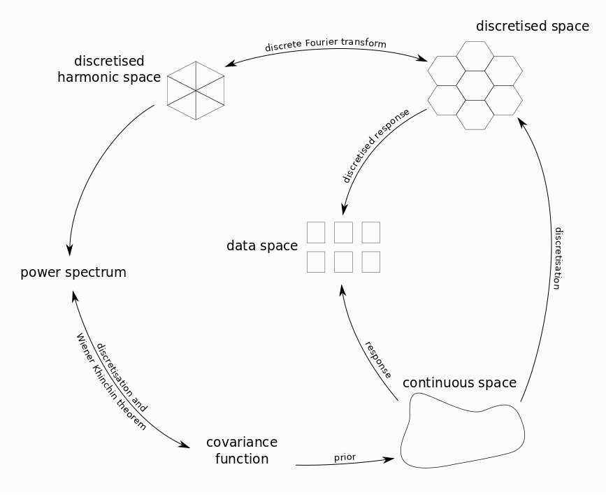
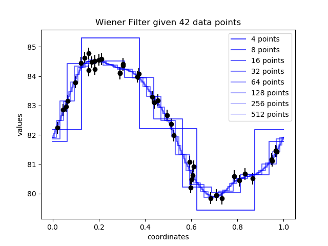

Discretisation and Volume
=========================

.. note:: Some of this discussion is rather technical and may be skipped in a first read-through.

Setup
.....

IFT employs stochastic processes to model distributions over function spaces, in particular Gaussian processes :math:`s \sim \mathcal{G}(s,k)` where :math:`k` denotes the covariance function.
The domain of the fields, and hence :math:`k`, is given by a Riemannian manifold :math:`(\mathcal{M},g)`, where :math:`g` denotes a Riemannian metric.
Fields are defined to be scalar functions on the manifold, living in the function space :math:`\mathcal{F}(\mathcal{M})`.
Unless we find ourselves in the lucky situation that we can solve for the posterior statistics of interest analytically, we need to apply numerical methods.
This is where NIFTy comes into play.

    Figure 1: Sketch of the various spaces and maps involved in the inference process.

A typical setup for inference of such signals using NIFTy is shown in figure 1.
We start with a continuous signal :math:`s \in \mathcal{S}`, defined in some function space :math:`\mathcal{S} := \mathcal{F}(\mathcal{M})` over a manifold :math:`(\mathcal{M},g)` with metric :math:`g`.
This is measured by some instrument, e.g. a telescope.
The measurement produces data in an unstructured data space :math:`\mathcal{D}` via a known response function :math:`R : \mathcal{S} \rightarrow \mathcal{D}` and involves noise :math:`\mathcal{D} \ni n \sim \mathcal{N}(n | 0, N)` with known covariance matrix :math:`N`.
In the case of additive noise, the result of the measurement is given by

.. math::

    d = R(s) + n \, .

Discretisation and index notation
.................................

To compute anything numerically, we first need to represent the problem in finite dimensions.
As for stochastic processes, several discretisations of :math:`\mathcal{S}` like collocation methods, expansion into orthogonal polynomials, etc. can be used (see [1]_, [2]_ for an overview and further information about their reliability).
In particular, NIFTy uses the midpoint method as reviewed in section 2.1 of [1]_ and Fourier expansion.

Without going into the details, discretisation methods basically introduce a finite set of basis functions :math:`\{\phi_i\}_{i\in \mathcal{I}}`, where :math:`\mathcal{I}` denotes a generic index set with :math:`|\mathcal{I}| = N` being the chosen discretisation dimension.
Any Riemannian manifold :math:`(\mathcal{M},g)` is equipped with a canonical scalar product given by

.. math::

    \left< a , b \right>_{\mathcal{M}} = \int_{\mathcal{M}} \mathrm{d}x \, \sqrt{|g|} \, a(x) \, b(x) \, .

Projection to the finite basis :math:`\{\phi_i\}_{i\in \mathcal{I}}` is then given by

.. math::

    f^i = v^{ij} \, \left< f , \phi_j \right>_{\mathcal{M}} \,

where the Einstein summation convention is assumed and we defined the volume metric

.. math::
   v_{ij} = \left< \phi_i , \phi_j \right>_{\mathcal{M}} \, ,

along with its inverse, :math:`v^{ij}`, satisfying :math:`v^{ij}v_{jk} = \delta^i_k`.

Obviously, the basis :math:`\{\phi_i\}_{i\in \mathcal{I}}` needs to be chosen s.th. the volume metric is invertible, otherwise we run into trouble.
Volume factors are encoded into the :math:`v_{ij}`.
For specific choices of the basis :math:`\{\phi_i\}_{i\in \mathcal{I}}`, e.g. indicator functions in the case of a pixelation, the entries of :math:`v_{ij}` are indeed just the volumes of the elements.
Lowering and raising indices works with :math:`v_{ij}` and :math:`v^{ij}` just as usual.

After projection, any function :math:`f \in \mathcal{S}` is represented by its approximation :math:`\hat{f} \in \hat{\mathcal{S}} \simeq \mathbb{R}^N`, where

.. math::

    \hat{f} = f^i\,\phi_i \, ,

which defines an embedding :math:`\hat{\mathcal{S}} \hookrightarrow \mathcal{S} = \mathcal{F}(\mathcal{M})`.

**Changes of base** are performed by reapproximating the :math:`\{\phi_i\}_{i\in \mathcal{I}}` in terms of another basis :math:`\{\phi'_i\}_{i\in \mathcal{I'}}`:

.. math::

    \phi_i \approx (\phi_i)^j \, \phi'_j \, =: \beta_i^{\,j} \, \phi'_j \, ,

which in general implies additional loss of information unless the two bases are compatible, i.e. encode the same information.
The latter is e.g. true for regular collocation grids on tori and the associated cropped Fourier series.
The discrete Fourier transform then maps between those bases without loss of information.

**Discretisation of operators** works in the same way by expansion.
For illustration purposes, let :math:`A: \mathcal{S} \rightarrow \mathcal{S}` be a (not necessarily linear) operator.
The result of its action on functions :math:`s` is known and may be expanded in :math:`\{\phi_i\}_{i\in \mathcal{I}}`, i.e.

.. math::
   A[s] = (A[s])^k \, \phi_k \, ,

where the domain of the operator may be restricted to the image of the embedding given above.
Integrals can now be written as

.. math::

    \left< s , A[t] \right>_{\mathcal{M}} \approx s^i \left< \phi_i , \phi_j \right>_{\mathcal{M}} (A[t])^j \equiv s^i \, v_{ij} \, (A[t])^j \, ,

where the appearance of the volume metric can be hidden by lowering the first index of the operator,

.. math::

    (A[w])_k := v_{km} \, (A[w])^m \, .

Hence, the volume metric need not be carried along if the operators are defined in this fashion right from the start.
Linear operators mapping several functions to another function are completely specified by their action on a given basis, and we define

.. math::

    A^k_{\,\,mn\ldots} := (A[\phi_m,\phi_n,\ldots])^k \, .

If :math:`A` is a (linear) integral operator defined by a kernel :math:`\tilde{A}: \mathcal{M} \times \cdots \mathcal{M} \rightarrow \mathbb{R}`, its components due to :math:`\{\phi_i\}_{i\in \mathcal{I}}` are given by

.. math::

    A^k_{\,\,ij\ldots}
    &= v^{km} \, \left< \phi_m, A[\phi_i,\phi_j,\ldots] \right>_{\mathcal{M}} \\
    &= v^{km} \, \int_{\mathcal{M}} \mathrm{d} x\,\sqrt{|g|}\,\left(\prod_{n}^{|\{ij\ldots\}|}\int_{\mathcal{M}} \mathrm{d} y_n \, \sqrt{|g|}\right) \,\,\phi_m(x)\, \tilde{A}(x,y_1,y_2,\ldots)\, \phi_i(y_1) \, \phi_j(y_2) \cdots \, .

.. [1] Bruno Sudret and Armen Der Kiureghian (2000), "Stochastic Finite Element Methods and Reliability: A State-of-the-Art Report"
.. [2] Dongbin Xiu (2010), "Numerical methods for stochastic computations", Princeton University Press.

Resolution and self-consistency
...............................

Looking at figure 1, we see that the there are two response operators:
On the one hand, there is the actual response :math:`R: \mathcal{S} \rightarrow \mathcal{D}` of the instrument used for measurement, mapping the actual signal to data.
On the other hand, there is a discretised response :math:`\hat{R}: \hat{\mathcal{S}} \rightarrow \mathcal{D}`, mapping from the discretised space to data.
Apparently, the discretisation and the discretised response need to satisfy a self-consistency equation, given by

.. math::
    R = \hat{R} \circ D \, .

An obvious corollary is that different discretisations :math:`D, D'` with resulting discretised responses :math:`\hat{R}, \hat{R}'` will need to satisfy

.. math::
    \hat{R} \circ D = \hat{R}' \circ D' \, .

NIFTy is implemented such that in order to change resolution, only the line of code defining the space needs to be altered.
It automatically takes care of dependent structures like volume factors, discretised operators and responses.
A visualisation of this can be seen in figure 2, which displays the MAP inference of a signal at various resolutions.

    Figure 2: Inference result converging at high resolution.

Implementation in NIFTy
.......................

.. currentmodule:: nifty8

Most codes in NIFTy will contain the description of a measurement process or,
more generally, a log-likelihood.
This log-likelihood is necessarily a map from the quantity of interest (a field) to a real number.
The log-likelihood has to be unitless because it is a log-probability and should not scale with resolution.
Often, log-likelihoods contain integrals over the quantity of interest :math:`s`, which have to be discretized, e.g. by a sum

.. math::

    \int_\Omega \text{d}x\, s(x) \approx \sum_i s^i\int_{\Omega_i}\text{d}x\, 1

Here the domain of the integral :math:`\Omega = \dot{\bigcup_q} \; \Omega_i` is the disjoint union over smaller :math:`\Omega_i`, e.g. the pixels of the space, and :math:`s_i` is the discretised field value on the :math:`i`-th pixel.
This introduces the weighting :math:`V_i=\int_{\Omega_i}\text{d}x\, 1`, also called the volume factor, a property of the space.
NIFTy aids you in constructing your own log-likelihood by providing methods like :func:`~field.Field.weight`, which weights all pixels of a field with their corresponding volume.
An integral over a :class:`~field.Field` :code:`s` can be performed by calling :code:`s.weight(1).sum()`, which is equivalent to :code:`s.integrate()`.
Volume factors are also applied automatically in the following places:

 - :class:`~operators.harmonic_operators.FFTOperator` as well as all other harmonic operators.
   Here the zero mode of the transformed field is the integral over the original field, thus the whole field is weighted once.
 - Some response operators, such as the :class:`~library.los_response.LOSResponse`.
   In this operator a line integral is discretised, so a 1-dimensional volume factor is applied.
 - In :class:`~library.correlated_fields.CorrelatedField` as well as :class:`~library.correlated_fields.MfCorrelatedField`.
   Both describe fields with a smooth, a priori unknown correlation structure specified by a power spectrum.
   The field is multiplied by the square root of the total volume of it domain's harmonic counterpart.
   This ensures that the same power spectrum can be used regardless of the chosen resolution, provided the total volume of the space remains the same.
   It also guarantees that the power spectra in NIFTy behave according to their definition, i.e. the power of a mode :math:`s_k` is the expectation value of that mode squared, divided by the volume of its space :math:`P(k) = \left\langle s_k^2 \right\rangle / V_k`.

Note that in contrast to some older versions of NIFTy, the dot product :code:`s.vdot(t)` of fields does **not** apply a volume factor, but instead just sums over the field components,

.. math::
  s^\dagger t = \sum_i \overline{s^i}\, t^i \, ,

where the bar denotes complex conjugation.
This dot product is **not** invariant under changes in resolution, as then the number of discretised field components increases.
Upper index components like :math:`s^i`, however, are designed **not** to scale with the volume.

One solution to obtain a resolution independent quantity is to make one of the two factors extensive while the other stays intensive.
This is more explicit when intensive quantities are denoted by an upper index and extensive quantities by a lower index,

.. math::
  s^\dagger t =  \overline{s^i} t_i

where we used Einstein sum convention.
Here, the volume metric is incorporated by lowering one index, i.e. :math:`t_i = v_{ij}\,t^j`.
When building statistical models, all indices will end up matching this upper-lower convention automatically, e.g. for a Gaussian log-likelihood :math:`L` we have

.. math::
  L = \frac{1}{2}\overline{s^i} \left(S^{-1}\right)_{ij} s^j

with the covariance defined by

.. math::
   S^{ij} = \left<s^i\overline{s^j}\right>\ .

Consequently, the inverse covariance operator will automatically have lower indices,

.. math::
   \left(S^{-1}\right)_{ij} S^{jk} = \delta^{\,\,k}_j\ ,

ensuring that the whole log-likelihood expression does not scale with resolution.
**This upper-lower index convention is not coded into NIFTy**, in order to not reduce user freedom.
One should however have this in mind when constructing log-likelihoods in order to ensure resolution independence.

Harmonic Transform Convention
.............................

In NIFTy the convention for the harmonic transformations is set by requiring the zero mode of the transformed field to be the integral over the original field.
This choice is convenient for the Fourier transformation and used throughout the literature.
Note that for the spherical harmonics this convention is only rarely used and might result in unexpected factors in the transformed field.

To be specific, for the spherical harmonics transformation this means that a monopole of unit amplitude in position-space which is transformed to the spherical harmonics domain and back to the original position space via the adjoint transformation will have a non-unit amplitude afterwards.
The factor between the input field and the twice transformed field is :math:`1/4\pi`.
In comparison to the convention used in HEALPix, this corresponds to dividing the output of the HEALPix transformed field by :math:`\sqrt{4\pi}` in each transformation.

Depending on the use-case, additional volume factors must be accounted for.
This is especially true if one wants to define the inverse transformation.
Note that the convention for the harmonic transformations used in NIFTy results in non-unitary operators.
