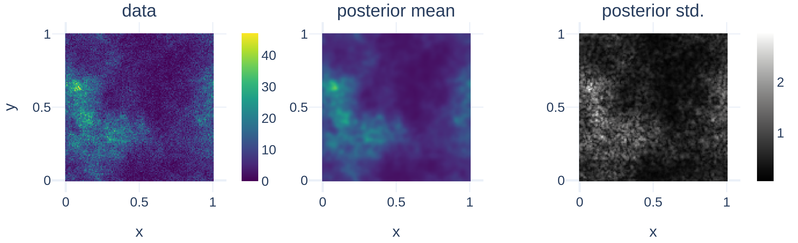

<!--
## JAX + NIFTy Paper
* USP: selling point: speed
* Bonus: higher order diff for more efficient optimization and all of Tensorflow and Tensorflow for all
* GP
  * Regular Grid Refinement
  * KISS-GP
  * Grid Refinement
* Posterior Approx.
  * HMC but with variable dtype handling
  * JIT-able VI and also (indirectly) available for Tensorflow
* predecessor enabled 100B reconstruction
* middle ground between tools like blackjax and pymc
-->

# Summary

Imaging is the process of transforming noisy, incomplete data into a space that humans can interpret.
\texttt{NIFTy} is a Bayesian framework for imaging and has already successfully been applied to many fields in astrophysics.
A focus on CPU computing and previous design decisions held the performance and the development of methods in \texttt{NIFTy} back.
We present a re-write of \texttt{NIFTy}, coined \texttt{NIFTy.re}, which bridges \texttt{NIFTy} to the Machine Learning ecosystem, reworks the modeling principle, extends the inference strategies, and outsources much of the heavy lifting to JAX.
The re-write dramatically accelerated models written in \texttt{NIFTy}, lays the foundation for new kinds of inference machineries, improves maintainability, and enables the interoperability of \texttt{NIFTy} with the JAX Machine Learning ecosystem.

# Statement of Need

Imaging commonly involves millions to billions of pixels.
Each pixel usually corresponds to one or more correlated degrees of freedom in the model space.
Modeling millions to billions of degrees of freedom is computationally demanding.
However, imaging is not only computationally demanding but also statistically challenging.
The noisy input requires a statistical treatment and needs to be accurately propagated from the input to the final image.
To infer an image from noisy data, we require an inference machine that not only handles millions to billions of degrees of freedom but one that does so in a statistically rigorous way.

\texttt{NIFTy} is a Bayesian imaging library [@Selig2013; @Steiniger2017; @Arras2019].
It is designed to infer the million to billion dimensional posterior distribution in the image space from noisy input data.
At the core of \texttt{NIFTy} lies a set of powerful Gaussian Process (GP) models and accurate Variational Inference (VI) algorithms.

\texttt{NIFTy.re} is a rewrite of \texttt{NIFTy} in JAX [@Jax2018] with all relevant previous GP models, new, more flexible GP models, and a more flexible posterior approximation machinery.
By being written in JAX, \texttt{NIFTy.re} effortlessly runs on accelerator hardware such as the GPU and TPU, vectorizes models whenever possible, just-in-time compiles code for additional performance, and enables new kinds of inference machineries thanks to being able to retrieve higher order derivates.
\texttt{NIFTy.re} switches from a home-grown automatic differentiation engine that was used in \texttt{NIFTy} to JAX's automatic differentiation engine.
We envision to harness significant gains in maintainability of \texttt{NIFTy.re} compared to \texttt{NIFTy} and a faster development cycle for new features.

<!-- Mention (if applicable) a representative set of past or ongoing research projects using the software and recent scholarly publications enabled by it. -->
We expect \texttt{NIFTy.re} to be highly useful for many imaging applications and envision many applications within and outside of astrophysics [@Arras2019; @Arras2022; @Leike2019; @Leike2020; @Mertsch2023; @Roth2023DirectionDependentCalibration; @Hutschenreuter2023; @Tsouros2023; @Roth2023FastCadenceHighContrastImaging; @Hutschenreuter2022; @ScheelPlatz2023; @Frank2017; @Welling2021; @Westerkamp2023].
\texttt{NIFTy.re} has already been successfully used in two galactic tomography publications [@Leike2022; @Edenhofer2023].
A very early version of \texttt{NIFTy.re} enabled a 100 billion dimensional reconstruction using a maximum posterior inference.
In a newer publication, \texttt{NIFTy.re} was used to infer a 500 million dimensional posterior dimensional using VI [@Knollmueller2019].
The latter publication extensively used \texttt{NIFTy.re}'s GPU support, which yielded orders of magnitude speed-ups.
With \texttt{NIFTy.re} bridging ideas from \texttt{NIFTy} to JAX, we envision many new possibilities for inferring classical Machine Learning models with \texttt{NIFTy}'s inference methods and using \texttt{NIFTy}-components such as the GP models in classical neural network frameworks.

<!-- A list of key references, including to other software addressing related needs. Note that the references should include full names of venues, e.g., journals and conferences, not abbreviations only understood in the context of a specific discipline. -->
\texttt{NIFTy.re} competes with other GP libraries as well as with probabilistic programming languages and frameworks.
Compared to GPyTorch [@Hensman2015], GPflow [@Matthews2017], george [@Sivaram2015], or TinyGP [@ForemanMackey2024], \texttt{NIFTy} and \texttt{NIFTy.re} focus on GP models for structured spaces.
Neither \texttt{NIFTy} nor \texttt{NIFTy.re} assume the posterior to be analytically accessible.
Instead, \texttt{NIFTy} and \texttt{NIFTy.re} try to approximate the true posterior using VI.
Compared to classical probabilistic programming languages such as Stan [@Carpenter2017] and frameworks such pyro [@Bingham2019], numpyro [@Phan2019], pyMC3 [@Salvatier2016], Emcee [@ForemanMackey2013], dynesty [@Speagle2020; @Koposov2023], or blackjax [@blackjax2020], \texttt{NIFTy} and \texttt{NIFTy.re} focus on high dimensional inference with millions to billions of degrees of freedom.
\texttt{NIFTy} and \texttt{NIFTy.re} exploit the structure of probabilistic models in their VI techniques [@Frank2021].
With \texttt{NIFTy.re} the GP models and the VI machinery are now fully accessible in the JAX ecosystem and \texttt{NIFTy.re} components interact seamlessly with other JAX packages such as `blackjax` and `jaxopt` [@Blondel2021].

# Core Components

\texttt{NIFTy.re} brings tried and tested structured GP models and VI algorithms to JAX.
GP models are especially useful for imaging problems, while VI algorithms are essential to probing high dimensional posteriors, which are often encountered in imaging problems.
\texttt{NIFTy.re} infers the parameters of interest from noisy data given a stochastic mapping from the parameters of interest to the data a.k.a. a model.

\texttt{NIFTy} and \texttt{NIFTy.re} build up hierarchical models for the posterior.
The log-posterior function reads $\ln\mathcal{p(\theta|d)} \coloneqq \mathcal{l}(d, f(\theta)) + \ln\mathcal{p}(\theta) + \mathrm{const}$ with log-likelihood $\mathcal{l}$, forward model $f$ mapping the parameters of interest $\theta$ to the data space, and log-prior $\ln\mathcal{p(\theta)}$.
The goal of the inference is to draw samples from the posterior $\mathcal{p}(\theta|d)$.

What is considered part of the likelihood versus part of the prior is ill-defined.
Without loss of generality \texttt{NIFTy} and \texttt{NIFTy.re} formulate models such that the prior always is a standard Gaussian.
This choice of re-parameterization [@Rezende2015] is called standardization.
It is often carried out implicitly in the background without user input.
During standardization, all relevant details of the prior model are encoded in the forward model $f$.

## Gaussian Processes

One standard tool from the \texttt{NIFTy.re} toolbox are the structured GP models from \texttt{NIFTy}.
These models usually rely on the harmonic domain being easily accessible, e.g. for pixels spaced on a regular Cartesian grid, the natural choice to represent a stationary kernel is the Fourier domain.
In the generative picture, a realization $s$ drawn from a GP then reads $s = \mathcal{HT} \cdot \sqrt{P} \cdot \xi$ with $\mathcal{HT}$ the harmonic transform, $\sqrt{P}$ the square-root of the power-spectrum in harmonic space, and $\xi$ standard Gaussian random variables.
In the implementation in \texttt{NIFTy.re} and \texttt{NIFTy}, the user can choose between two adaptive kernel models, a non-parametric kernel $\sqrt{P}$ and a Matérn kernel $\sqrt{P}$ [@Arras2022; @Guardiani2022 for details on their implementation].
An example, initializing a non-parameteric GP prior for a $128 \times 128$ space with unit volume is shown in the following.

```python
from nifty8 import re as jft

dims = (128, 128)
cfm = jft.CorrelatedFieldMaker("cf")
cfm.set_amplitude_total_offset(offset_mean=2, offset_std=(1e-1, 3e-2))
# Axis over which the kernel is defined
cfm.add_fluctuations(
  dims,
  distances=tuple(1.0 / d for d in dims),
  fluctuations=(1.0, 5e-1),
  loglogavgslope=(-3.0, 2e-1),
  flexibility=(1e0, 2e-1),
  asperity=(5e-1, 5e-2),
  prefix="ax1",
  non_parametric_kind="power",
)
# Get the forward model for the GP prior
correlated_field = cfm.finalize()
```

Not all problems are well described by regularly spaced pixels.
For more complicated pixel spacings, \texttt{NIFTy.re} features Iterative Charted Refinement [@Edenhofer2022], a GP model for arbitrarily deformed spaces.
This model exploits nearest neighbor relations on various coarsening of the discretized modeled space and runs very efficiently on GPUs.
For one dimensional problems with arbitrarily spaced pixel, \texttt{NIFTy.re} also implements multiple flavors of Gauss-Markov processes.

## Building Up Complex Models

Models are rarely just a GP prior.
Commonly, a model contains at least several non-linearities that transform the GP prior or combine it with other random variables.
For building more complex models, \texttt{NIFTy.re} provides a `Model` class that offers a somewhat familiar object-oriented design yet is fully JAX compatible and functional under the hood.
The following code showcases such a model that builds up a slightly more involved model using the objects from the previous example.

```python
from jax import numpy as jnp


class Forward(jft.Model):
  def __init__(self, correlated_field):
    self._cf = correlated_field
    # Track a method with which a random input for the model. This is not
    # strictly required but is usually handy when building deep models.
    super().__init__(init=correlated_field.init)

  def __call__(self, x):
    # NOTE, any kind of masking of the output, non-linear and linear
    # transformation could be carried out here. Models can also combined and
    # nested in any way and form.
    return jnp.exp(self._cf(x))


forward = Forward(correlated_field)

data = jnp.load("data.npy")
lh = jft.Poissonian(data).amend(forward)
```

All GP models in \texttt{NIFTy.re} as well as all likelihoods are models and their attributes are exposed to JAX, meaning JAX understands what it means if a computation involves `self` or other models.
In other words, `correlated_field`, `forward`, and `lh` from the code snippets shown here are all so-called pytrees in JAX and, e.g., the following is valid code `jax.jit(lambda l, x: l(x))(lh, x0)` with `x0` some arbitrarily chosen valid input to `lh`.
Inspired by equinox [@Kidger2021], individual attributes of the class can be marked as non-static or static via `dataclass.field(metadata=dict(static=...))` for the purpose of compiling.
Depending on the value, JAX will either treat the attribute as unknown placeholder or as known concrete attribute and potentially inline it during compiles.
This mechanism is extensively used in likelihoods to avoid inlining large constants such as the data and avoiding expensive re-compiles whenever possible.

## Variational Inference

\texttt{NIFTy.re} is built for models with millions to billions of degrees of freedom.
To probe the posterior efficiently and accurately, \texttt{NIFTy.re} relies on VI.
Specifically, \texttt{NIFTy.re} implements Metric Gaussian Variational Inference (MGVI) and its successor geometric Variational Inference (geoVI) [@Knollmueller2019 @Frank2021 @Frank2022].
At the core of both MGVI and geoVI lies an alternating procedure in which we switch between optimizing the Kullback–Leibler divergence for a specific shape of the variational posterior and updating the shape of the variational posterior.
MGVI and geoVI define the variational posterior via samples, specifically, via samples drawn around an expansion point.
The samples in MGVI and geoVI exploit model-intrinsic knowledge of the posterior's approximate shape, encoded in the Fisher information metric and the prior curvature [@Frank2021].

\texttt{NIFTy.re} implements both MGVI and geoVI and allows for much finer control over the way samples are drawn and updated compared to \texttt{NIFTy}.
Furthermore, \texttt{NIFTy.re} exposes stand-alone functions for drawing MGVI and geoVI samples from any arbitrary model with a likelihood from \texttt{NIFTy.re} and a forward model that is differentiable by JAX.
In addition to stand-alone sampling functions, \texttt{NIFTy.re} also provides tools to configure and execute the alternating Kullback–Leibler divergence optimization and sample adaption at a higher abstraction level.
These tools are provided in a jaxopt-style optimizer class [@Blondel2021].

A typical minimization with \texttt{NIFTy.re} is shown in the following.
It retrieves six antithetically mirrored samples from the approximate posterior via 25 iterations of alternating between optimization and sample adaption.
The final result is stored in the `samples` variable.
A convenient one-shot wrapper for the below is `jft.optimize_kl`.
By virtue of all modeling tools in \texttt{NIFTy.re} being written in JAX, it is also possible to combine \texttt{NIFTy.re} tools with blackjax [@blackjax2020] or any other posterior sampler in the JAX ecosystem.

```python
from jax import random

key = random.PRNGKey(42)
key, sk = random.split(key, 2)
# NIFTy is agnostic w.r.t. the type of inputs it gets as long as they support
# core arithmetic properties. Tell NIFTy to treat our parameter dictionary as a
# vector.
samples = jft.Samples(pos=jft.Vector(lh.init(sk)), samples=None, keys=None)

delta = 1e-4
absdelta = delta * jft.size(samples.pos)

opt_vi = jft.OptimizeVI(lh, n_total_iterations=25)
opt_vi_st = opt_vi.init_state(
  key,
  # Implicit definition for the accuracy of the KL-divergence approximation;
  # typically on the order of 2-12
  n_samples=lambda i: 1 if i < 2 else (2 if i < 4 else 6),
  # Parametrize the conjugate gradient method at the heart of the sample-drawing
  draw_linear_kwargs=dict(
    cg_name="SL", cg_kwargs=dict(absdelta=absdelta / 10.0, maxiter=100)
  ),
  # Parametrize the minimizer used in the nonlinear update of the samples
  nonlinearly_update_kwargs=dict(
    minimize_kwargs=dict(
      name="SN", xtol=delta, cg_kwargs=dict(name=None), maxiter=5
    )
  ),
  # Parametrize the minimization of the KL-divergence cost potential
  kl_kwargs=dict(minimize_kwargs=dict(name="M", xtol=delta, maxiter=35)),
  sample_mode=lambda i: "nonlinear_resample" if i < 3 else "nonlinear_update",
)
for i in range(opt_vi.n_total_iterations):
  print(f"Iteration {i+1:04d}")
  # Continuously updates the samples of the approximate posterior distribution
  samples, opt_vi_st = opt_vi.update(samples, opt_vi_st)
  print(opt_vi.get_status_message(samples, opt_vi_st))
```



\autoref{fig:minimal_reconstruction_data_mean_std} shows an exemplary posterior reconstruction employing the above model.
The posterior mean agrees with the data but removes noisy structures.
The posterior standard deviation is approximately equal to typical differences between the posterior mean and the data.

## Performance compared to old NIFTy

We test the performance of \texttt{NIFTy.re} against \texttt{NIFTy} for the simple yet representative model from above.
To assess the performance, we benchmark $M_p \coloneqq F_p + \mathbb{1}$ with $F_p$ denoting the Fisher metric of the overall likelihood at position $p$ and the identity matrix $\mathbb{1}$ which is the curvature of the standardized prior analogous to the Fisher metric.
Within \texttt{NIFTy.re} the Fisher metric of the overall likelihood is decomposed into $J_{f,p}^\dagger N^{-1} J_{f,p}$ with $J_{f,p}$ the implicit Jacobian of the forward model $f$ at $p$ and $N$ the Fisher-metric of the Poisson likelihood.
We choose to benchmark $M_p$ as a typical VI minimization in \texttt{NIFTy.re} and \texttt{NIFTy} is dominated by calls to this function.


\autoref{fig:benchmark_nthreads=1+8_devices=cpu+gpu} shows the evaluation time in \texttt{NIFTy} for applying $M_p$ to a new tangent position and the evaluation time in \texttt{NIFTy.re} for building $M_p$ and applying it to a new tangent position for exponentially larger models.
We choose to exclude the build time of $M_p$ in \texttt{NIFTy} from the comparison, putting \texttt{NIFTy} at an advantage, as \texttt{NIFTy}'s automatic differentiation is built around calls to $M_p$ with $p$ rarely varying.
We ran the benchmark on one CPU core, eight CPU cores, and on a GPU on a compute-node with an Intel Xeon Platinum 8358 CPU clocked at 2.60G Hz and an NVIDIA A100 SXM4 80 GB HBM2 GPU.
We vary the size of the model by increasing the size of the two-dimensional square image grid.

For small image sizes, \texttt{NIFTy.re} on the CPU is about one order of magnitude faster than \texttt{NIFTy}.
Both reach about the same performance at an image size of roughly 15,000 pixels and continue to perform roughly the same for larger image sizes.
The performance increases by a factor of three to four with eight cores for \texttt{NIFTy.re} and \texttt{NIFTy} although \texttt{NIFTy.re} is slightly better at using the additional cores.
On the GPU, \texttt{NIFTy.re} is consistently about one to two orders of magnitude faster than \texttt{NIFTy} for images larger than 100,000 pixels.

We believe the performance benefits of \texttt{NIFTy.re} on the CPU for small models stem from the reduced python overhead by just-in-time compiling computations.
At image sizes larger than roughly 15,000 pixels, both evaluation times are dominated by the fast Fourier transform and are hence roughly the same as both use the same underlying implementation [@ducc0].
Typical models in \texttt{NIFTy.re} and \texttt{NIFTy} are often well aligned with GPU programming models and thus consistently perform well on the GPU.
Models such as the new GP model implemented in \texttt{NIFTy.re} are even better aligned with GPU programming models and yield even higher performance gains [@Edenhofer2022].

# Conclusion

We implemented the core GP and VI machinery of the Bayesian imaging package \texttt{NIFTy} in JAX.
The re-write moves much of the heavy-lifting from home-grown solutions into JAX, and we envision significant gains in maintainability of \texttt{NIFTy.re} and a faster development cycle moving forward.
The re-write accelerates typical models written in \texttt{NIFTy} by one to two orders of magnitude, lays the foundation for new kinds of inference machineries by enabling higher order derivates via JAX, and enables the interoperability of \texttt{NIFTy} with the VI and GP methods from the JAX Machine Learning ecosystem.

# Acknowledgements

Gordian Edenhofer acknowledges support from the German Academic Scholarship Foundation in the form of a PhD scholarship (``Promotionsstipendium der Studienstiftung des Deutschen Volkes'').
Philipp Frank acknowledges funding through the German Federal Ministry of Education and Research for the project "ErUM-IFT: Informationsfeldtheorie für Experimente an Großforschungsanlagen" (Förderkennzeichen: 05D23EO1).
Jakob Roth acknowledges financial support by the German Federal Ministry of Education and Research (BMBF) under grant 05A20W01 (Verbundprojekt D-MeerKAT).

# References

<!-- Citations to entries in paper.bib should be in
[rMarkdown](http://rmarkdown.rstudio.com/authoring_bibliographies_and_citations.html)
format.

For a quick reference, the following citation commands can be used:
- `@author:2001`  ->  "Author et al. (2001)"
- `[@author:2001]` -> "(Author et al., 2001)"
- `[@author1:2001; @author2:2001]` -> "(Author1 et al., 2001; Author2 et al., 2002)"
# Figures

Figures can be included like this:

and referenced from text using \autoref{fig:example}.

Figure sizes can be customized by adding an optional second parameter:
{ width=20% }
-->
